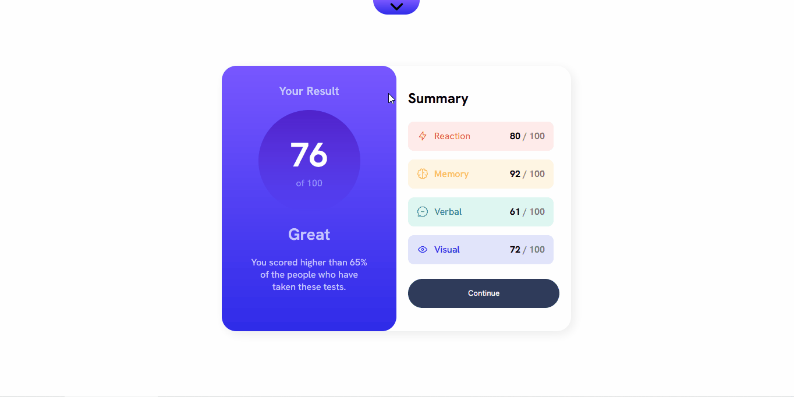

# Summary

- [The Project](#the-project)
    - [Built With](#built-with)
- [Installation](#installation)
    - [Pre-requisites](#pre-requisites)
    - [Steps](#steps)
- [Testing](#testing)

# The Project

Solution for a [Frontend Mentor exercise](https://www.frontendmentor.io/challenges/results-summary-component-CE_K6s0maV) where I have to create a responsive component that shows the average and individual scores of an user:

<b>I've made this project because...</b>

...I wanted to brush up my skills and chose a simpler challenge so I could focus more on practing TypeScript while making smaller, more specific commits and do a bit of <abbr title="Test Driven Development">TDD</abbr> as well.

## Built With

Project kickstarted with [Vite](https://vitejs.dev/) using the following technologies:

- <strong>HTML5, CSS3</strong>: Provides necessary structure and styling for the page
- <strong>JavaScript + [TypeScript](https://www.typescriptlang.org/)</strong>: JS allows interaction with the page and TS makes JS code type-safe, less prone to bugs.

- <strong>[React](https://react.dev/)</strong>: Turns the page into a <abbr title="Single Page Application">SPA</abbr>, making the user experience much smoother, and allows working with components, making coide easier to maintain and escalate.
    - <strong>[Styled Components](https://styled-components.com/)</strong>: Isolates styles, making them easier to be created, maintained and escalated.
- <strong>[Vitest](https://vitest.dev/)</strong>: Used for testing the project

# Installation

Want to run it in your own machine? Follow the following steps:

## Pre-requisites

- [Git](https://git-scm.com/downloads)
- A package manager (I used <strong>NPM</strong> which is installed together with [Node.js](https://nodejs.org/en/download))

## Steps

- (Optional) Fork the project
- Open your terminal and run `git clone https://github.com/alexgabriel8/results-summary-component.git`
    - <b>If you have forked the project</b>, substitute alexgabriel8 by your GitHub username.
- Lead your terminal to the root folder of the project
- Run the install command of your package manager
    - (I used <strong>NPM</strong> with the command `npm i`)
- Run the dev script and voilà! The project is running and all you need is to copy the URL in the terminal to your browser!
    - (Used <strong>NPM</strong> with the command `npm run dev`)

# Testing

If you use <strong>NPM</strong> as your package manager, type `npm run test` on your terminal at the root folder of the project to run Vitest.